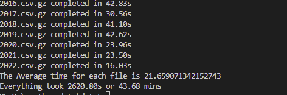
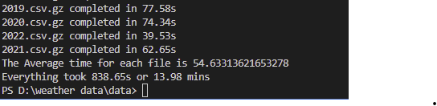
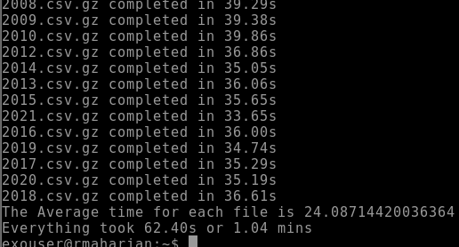
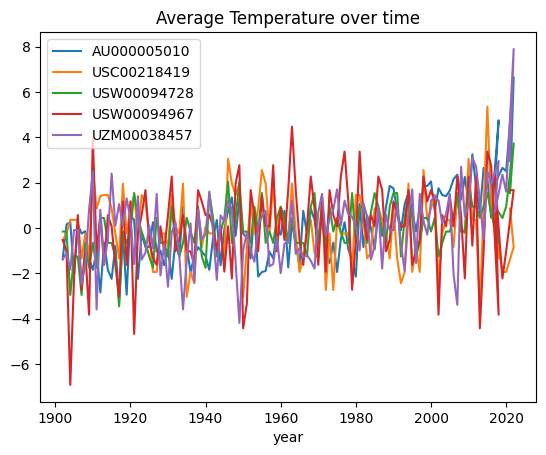

# Temperature Over Time

Calculate the average temperature for a five weather station for all year as the median of TMAX for all 365 days for the year. We can't use TAVG because there are only a handful of stations with complete records for TAVG starting in 1900.
We have weather data from 1902-2022.

```bash
├── data
│   ├── 1902.csv.gz
│   ├── 1903.csv.gz
│   ├── ...
│   ├── 2022.csv.gz
```

## Pipeline Without Parallelization

It took around 48 mins to run the pipeline without doing it parallel.



## Pipeline with Parallelization

we use python multiprocessing library. multiprocessing is a package that supports spawning processes using an API similar to the threading module. The multiprocessing package offers both local and remote concurrency, effectively side-stepping the Global Interpreter Lock by using subprocesses instead of threads. Due to this, the multiprocessing module allows the programmer to fully leverage multiple processors on a given machine.
More on [multiprocessing](https://docs.python.org/3/library/multiprocessing.html)

With 4 cores on laptop, it took 13.48 mins to finish our pipeline which is X3 faster.



With 64 cores on remote machine it took only 1.04 mins which is X42 faster than first one and x13 times faster than 4 cores.



## Final Graph


